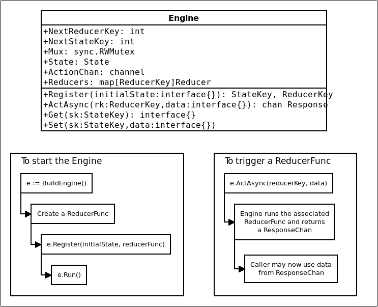

# Goengine

Goengine is a simple implementation of a concurrent shared-state design pattern
for Go. It is inspired by Mozilla's [Rob
Miller](https://blog.mozilla.org/services/2014/03/12/sane-concurrency-with-go/) and the [Redux pattern](https://redux.js.org/).

## System architecture

